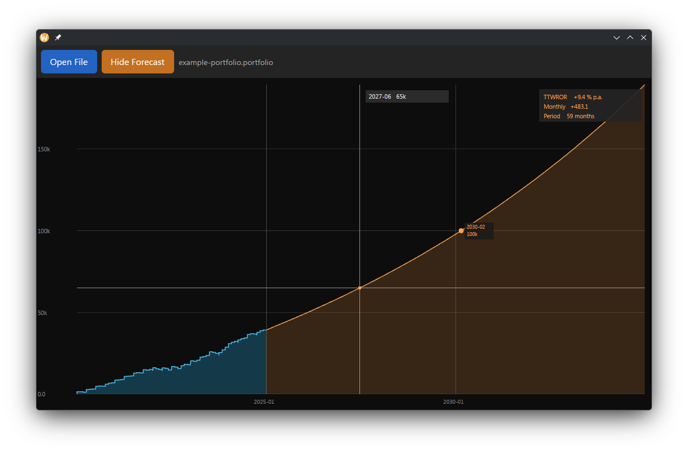
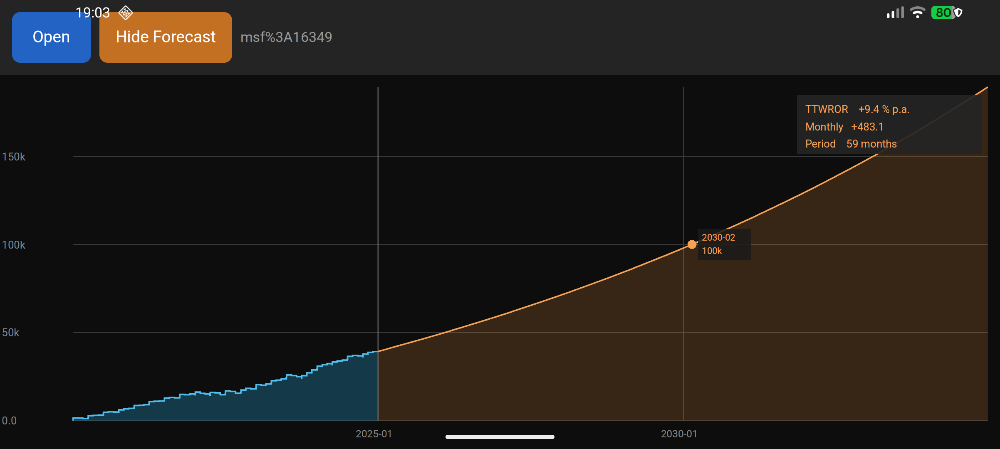

# Portfolio Forecast

A cross-platform [Portfolio Performance](https://www.portfolio-performance.info/) viewer built with [GPUI](https://github.com/zed-industries/zed/tree/main/crates/gpui) and [gpui-mobile](https://github.com/itsbalamurali/gpui-mobile).

Reads `.portfolio` files (ZIP or binary format) and displays NAV history as an interactive chart with the ability to calculate a [forecast](doc/forecast.md).

## Screenshots

Desktop:


Android:


## Workspace structure

```
portfolio-forecast/
├── common/     # Shared data layer: file parsing, protobuf types, NAV analysis, mobile UI views
├── android/    # Android cdylib — cargo-ndk entry point + JNI bridge
├── ios/        # iOS staticlib  — UIKit/ObjC entry point
└── desktop/    # Linux/macOS/Windows binary — native window via gpui_platform
```

## Prerequisites

### All platforms
- Rust (stable) — install via [rustup](https://rustup.rs)
- [`just`](https://github.com/casey/just) — `cargo install just`

### Android
- Android SDK + NDK (set `ANDROID_HOME` or `ANDROID_SDK_ROOT`)
- `cargo-ndk` — `cargo install cargo-ndk`
- Rust target: `rustup target add aarch64-linux-android`
- Java 17+ for Gradle

### iOS (macOS only) - untested incomplete
- Xcode + Command Line Tools
- `xcodegen` — `brew install xcodegen`
- Rust targets:
  ```
  rustup target add aarch64-apple-ios          # physical device
  rustup target add aarch64-apple-ios-sim      # simulator
  ```

## Quick start

```sh
# Check host-compatible crates (common + desktop)
just check
# Check Android crate (cross-compilation)
just check-android

# Run desktop app
just desktop

# Build Android APK (debug) and install on connected device
just android

# Build Android APK (release)
just android-release

# Build iOS app and run on device (macOS only)
just ios

# Build iOS app for simulator (macOS only)
just ios-sim
```

## Dependencies

| Crate | Source |
|---|---|
| `gpui` | git `zed-industries/zed` @ `5688167` |
| `gpui-mobile` | git `itsbalamurali/gpui-mobile` @ `1d3ec2a` |
| `gpui_platform` | git (same Zed rev) — desktop platform dispatcher |
| `prost` / `prost-build` | crates.io `0.13` |
| `rfd` | crates.io `0.17` — desktop file dialog |

> **Local gpui-mobile patch**: to test a local checkout, add to the root `Cargo.toml`:
> ```toml
> [patch.'https://github.com/itsbalamurali/gpui-mobile.git']
> gpui-mobile = { path = "/path/to/local/gpui-mobile" }
> ```

## Android build details

The `android/build.sh` script runs the full pipeline:
1. `cargo ndk -t arm64-v8a` → produces `libportfolio_forecast.so`
2. `./gradlew assembleDebug` (or `assembleRelease`) → APK
3. `adb install` + `adb shell am start` (unless `--no-run`)

App ID: `dev.gpui.portfolio.forecast`  
Min SDK: 26 (Android 8.0)  
Target SDK: 34

## License

Licensed under AGPL-3.0, Apache-2.0, or GPL-3.0 — see `LICENSE-*` files.
